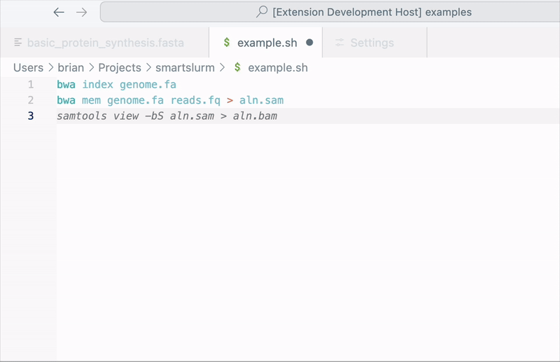

# **SmartSlurm Parameter Generator**

Automate the generation of Slurm parameters for your HPC bash scripts using AI! This VSCode extension analyzes your bash scripts and predicts optimal Slurm parameters such as memory, time, and CPUs. Save time, avoid guesswork, and ensure efficient resource allocation.



---

## **Features**
- Automatically generates Slurm parameters based on the contents of your bash script.
- Outputs Slurm parameters in the format:
  ```bash
  #SBATCH --time=<time>
  #SBATCH --mem=<memory>
  #SBATCH --cpus-per-task=<cpus>
  ```
- Integrates seamlessly into VSCode.
- Customizable settings for API endpoint, key, and response limits.

---

## **Installation**
1. Download and install the extension from the VSCode Marketplace (or manually install the `.vsix` file if unpublished).
2. Open VSCode and activate the extension for your bash script files.

---

## **Usage**
1. Open a bash script in VSCode.
2. Use the Command Palette (`Ctrl+Shift+P` or `Cmd+Shift+P` on Mac) and select:
   **`Slurm Parameter Generator: Generate Slurm Parameters`**.
3. The extension will analyze your script and prepend the generated Slurm parameters at the top.

---

## **Configuration**
This extension requires an API key and endpoint for the AI service. You can configure the following settings:

1. Open the Command Palette and select **Preferences: Open Settings (UI)**.
2. Search for `Slurm Parameter Generator`.
3. Configure the following options:
   - **API Key (`slurmParamGenerator.apiKey`)**: Your API key for the AI service.
   - **API Endpoint (`slurmParamGenerator.apiEndpoint`)**: The endpoint of the AI service.
     - Default: `https://api.openai.com/v1/chat/completions`.
   - **Max Tokens (`slurmParamGenerator.maxTokens`)**: Maximum number of tokens for the AI response (default: `150`).

**Example Settings:**
```json
{
    "slurmParamGenerator.apiKey": "sk-xxxxxxxxxxxxxxxxxxxxxxxxxxxx",
    "slurmParamGenerator.apiEndpoint": "https://api.openai.com/v1/chat/completions",
    "slurmParamGenerator.maxTokens": 150
}
```

---

## **Commands**
The following commands are available via the Command Palette:

- **Generate Slurm Parameters**: Analyze the current bash script and generate Slurm parameters.
- **Open Settings**: Quickly navigate to the extension settings.

---

## **Example**
**Input Bash Script:**
```bash
#!/bin/bash
python process_data.py
```

**Generated Slurm Parameters:**
```bash
#SBATCH --time=01:00:00
#SBATCH --mem=4GB
#SBATCH --cpus-per-task=2

#!/bin/bash
python process_data.py
```

---

## **Requirements**
- A valid API key for the AI service (e.g., OpenAI API).
- Internet connectivity for accessing the AI service.

---

## **Development**
To contribute or build this extension locally:

1. Clone the repository:
   ```bash
   git clone https://github.com/bwentzloff/smartSlurm.git
   cd slurm-param-generator
   ```
2. Install dependencies:
   ```bash
   npm install
   ```
3. Run the extension in the VSCode Extension Development Host:
   ```bash
   code .
   ```
   Press `F5` to launch the development environment.

4. Package the extension:
   ```bash
   vsce package
   ```

---

## **Known Issues**
- Long or complex bash scripts may lead to truncated responses. Increase the `maxTokens` setting if needed.
- Ensure the API key is valid and the endpoint is correct to avoid errors.

---

## **Roadmap**
- Add support for additional job schedulers.
- Allow users to provide feedback on predictions to improve accuracy.
- Include more advanced resource estimation features.

---

## **License**
This extension is licensed under the [MIT License](LICENSE).

---

